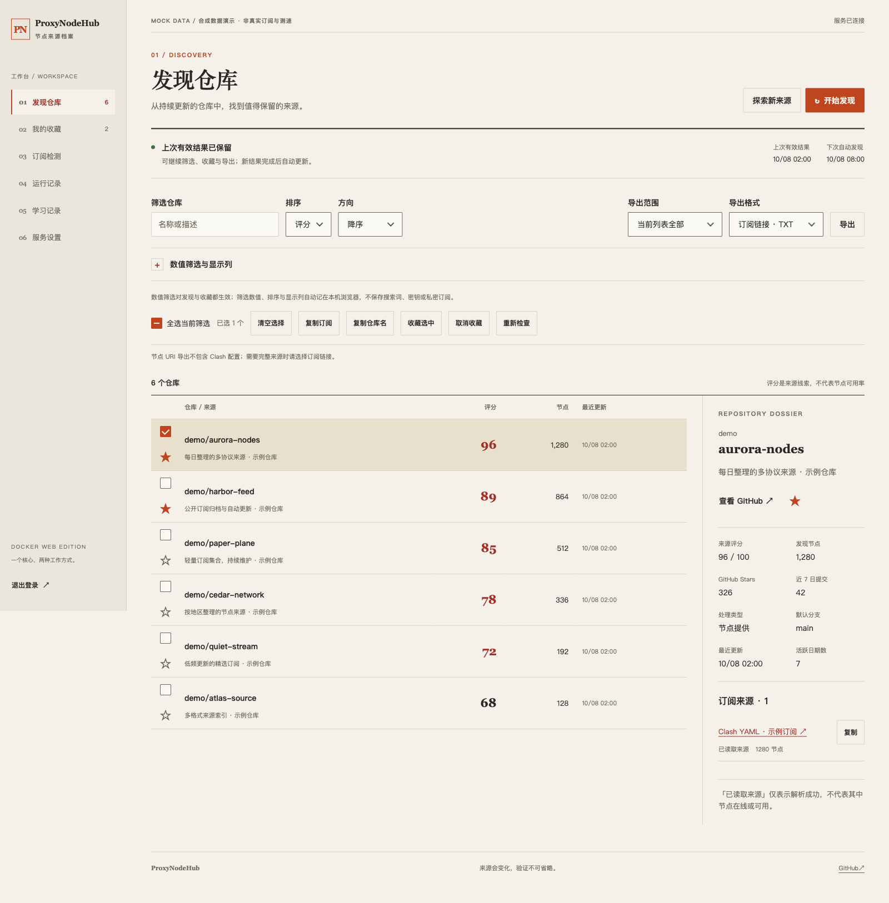
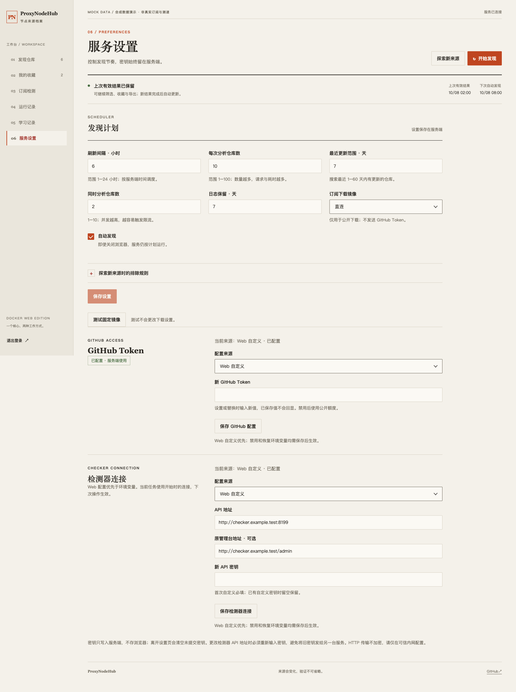
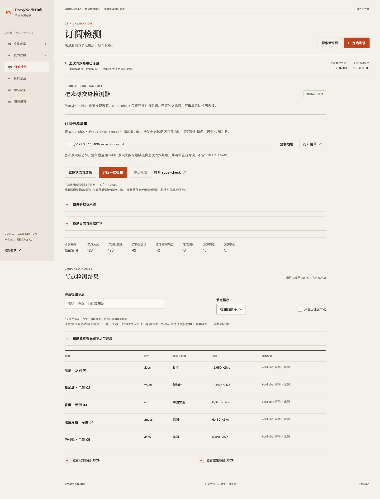

<div align="center">

# ProxyNodeHub

### GitHub 免费节点仓库监控与聚合工具

[English](README.en.md) | **中文**

<p align="center"><a href="https://www.right.com.cn" alt="恩山论坛"></a>　<a href="https://www.koolcenter.com/" alt="酷友社"></a>　<a href="https://linux.do" alt="LINUX DO"></a></p>


</div>

---

> ⭐ **如果 ProxyNodeHub 对你有用，请务必点一个 Star，这是我持续维护这个项目最大的动力。**

---

## 项目简介

ProxyNodeHub 用于发现 GitHub 上活跃的免费节点仓库：分析活跃度、去重分散的节点、直接给出可用的订阅链接。点一次「搜索并分析」，剩下的梳理工作全部由它完成。

不必再逐个仓库翻找、比对、手动拼接订阅。它会挑出更新最勤、维护最稳的仓库，合并去重后一次导出；也能翻出那些藏在角落、不易察觉的冷门仓库——在免费节点这个领域，冷门往往意味着负载低、活得久，那才是真正好用的宝藏节点。

## 功能特性

下表主要描述 Windows 客户端。Docker Web 复用发现与分析核心，提供发现、筛选、收藏、导出、任务记录、定时设置及外部 subs-check 控制；不会启动桌面壳或第二个测速内核。

| | |
|---|---|
| **六层探测引擎** | 特征库学习 → 硬编码映射 → 文件树筛选 → 常见路径探测 → README 解析 → 兜底候选 |
| **并发搜索** | 8 个关键词并发请求 GitHub REST API |
| **活跃度评分** | 提交频率 + 均匀度 + 自动化 + 隐蔽度，100 分制 |
| **节点去重** | 以 `server:port` 为键去重，合并导出订阅 |
| **四种处理模式** | 🚀 极速 / ⚖️ 标准 / 🔍 深度 / 🐢 兼容，各自独立并发度 |
| **自动代理** | 13 个加速镜像，自动测速、失效回退、5 分钟结果缓存 |
| **搜索历史过滤** | 已搜索仓库自动跳过（1–30 天可调） |
| **收藏管理** | 独立视图，重启后保留 |
| **特征库学习** | 自动记住探测成功过的路径，下次更快 |
| **日志持久化** | 日志滚动保存，保留天数可调，一键清理 |

## 运行环境

- **自包含版** — Windows 10 及以上（x64），无需安装任何运行时。
- **框架依赖版** — Windows 10 及以上（x64），并需安装 [.NET 8 Desktop Runtime](https://dotnet.microsoft.com/download/dotnet/8.0)。

## 快速开始

1. 从 [Releases](../../releases) 获取构建包——无任何前置依赖请选 `ProxyNodeHub_v0.0.1_self-contained.zip`。
2. 解压到任意目录，运行 `ProxyNodeHub.exe`。
3. 按 **F5**（或点击「搜索并分析」）开始搜索与分析。

GitHub Token 是可选项。桌面端当前将其明文保存在 EXE 同目录的 `settings.json`，并非 Windows 凭据管理器加密存储；请勿提交或分享该文件。搜索 API 有独立限额，以 GitHub 实际响应为准。

## Docker Web 部署

### Web 版本介绍

本 fork 在保留原 Windows 客户端的基础上，提供可在服务器、NAS 或软路由长期运行的 Docker Web 工作台。它是独立的 ASP.NET Core 服务，不是远程桌面：浏览器负责交互，容器负责发现、调度和持久化，关闭网页不影响后台任务。

| 版本 | 适用场景 | 实现与运行方式 |
|---|---|---|
| Windows 客户端 | 在本机搜索、导出和管理本地测速内核 | `src/`，WinForms / .NET 8 |
| Docker Web | 内网多台设备访问同一工作台，后台定时发现和集中保存结果 | `web/`，ASP.NET Core / .NET 10；当前 CI 镜像为 `linux/amd64` |
| 共享核心 | GitHub 搜索、仓库评分、订阅探测、解析和学习 | `core/`，两端复用，不另维护一套发现逻辑 |

Web 提供六个入口：发现仓库、我的收藏、订阅检测、运行记录、学习记录和服务设置。支持筛选排序、批量收藏/重检、按范围导出、在线配置 GitHub Token 与检测器连接，以及持久化发现计划。下拉框、复选框和确认框采用与暖纸底、墨色文字相配的自设计样式，同时保留语义 HTML 和键盘操作。

subs-check 是**可选的独立检测服务**，不打包在本镜像内。不接入它仍可发现、收藏和导出来源；接入后可在 Web 查看检测状态、速度与媒体结果，调整白名单参数、读取日志和下载检测产物。`/subscriptions.txt` 是交给检测器的来源 URL 清单，**不是测速后的节点订阅**。

Web 与客户端并非全部功能相同：本机内核安装/升级、完整检测 YAML 编辑、按轮历史回灌等没有原样迁入 Web。已覆盖能力与差异见 [完整复核](docs/web-parity-review.md)，不把跳转外部管理台算作 Web 已实现。

当前镜像支持 `linux/amd64`，内置 .NET 10 运行时；宿主无需安装 .NET，尚未发布 ARM64 镜像。

### Web 界面预览（mock 数据）

以下截图直接使用本项目当前前端，通过隔离浏览器拦截 API 填入虚构仓库、`example.com` / `example.test` 地址与模拟检测结果；没有连接生产 API，也没有真实 Token、密码、私密订阅或测速数据。图中的本机清单地址仅用于截图，部署时请使用检测器可访问的宿主机地址。



<details>
<summary>服务设置：发现计划、GitHub Token 与检测器连接</summary>



</details>

<details>
<summary>订阅检测：独立 subs-check 的模拟状态与结果</summary>



</details>

### 拉取镜像与启动

使用 [Docker Hub 镜像](https://hub.docker.com/r/helloworldz1024/proxynodehub)，无需在服务器克隆源码或安装 .NET。先确认目标提交的 [Actions](https://github.com/goodnightzsj/ProxyNodeHub/actions/workflows/build.yml) 发布成功，再拉取镜像：

```sh
docker pull helloworldz1024/proxynodehub:latest
```

`latest` 指向最近一次成功推送的镜像，不保证等于 GitHub 当前提交；生产升级建议使用 `sha-<完整提交>` 固定版本。仅需自行构建时，在源码根目录执行 `docker build -t proxynodehub:local .`，并将下方镜像名替换为该本地标签。服务使用根目录 `Dockerfile`，`tests/Dockerfile` 不是服务镜像。

以下以 `192.168.31.122` 和 `/mnt/usb1-1/proxynodehub` 为例；其他主机请替换地址与路径，不使用 `/script` 存放数据。首次准备持久化目录和管理员密码文件（只执行一次，不覆盖已有密码）：

```sh
mkdir -p /mnt/usb1-1/proxynodehub/data /mnt/usb1-1/proxynodehub/secrets
test -e /mnt/usb1-1/proxynodehub/secrets/admin-password || \
  (umask 077; openssl rand -base64 -out /mnt/usb1-1/proxynodehub/secrets/admin-password 32)
chown -R 1654:1654 /mnt/usb1-1/proxynodehub/data /mnt/usb1-1/proxynodehub/secrets
chmod 750 /mnt/usb1-1/proxynodehub/data /mnt/usb1-1/proxynodehub/secrets
chmod 600 /mnt/usb1-1/proxynodehub/secrets/admin-password
```

完整启动命令（已有同名容器时先停止并保留其数据；不要直接重复创建）：

```sh
docker run -d \
  --name proxynodehub \
  --restart always \
  --read-only \
  --tmpfs /tmp:rw,noexec,nosuid,size=64m \
  --cap-drop ALL \
  --security-opt no-new-privileges \
  --memory 512m --cpus 1 --pids-limit 128 \
  --log-opt max-size=5m --log-opt max-file=2 \
  -p 192.168.31.122:8388:8080 \
  -p 172.17.0.1:8388:8080 \
  -e ADMIN_PASSWORD_FILE=/run/secrets/admin-password \
  -e GITHUB_TOKEN="${GITHUB_TOKEN:-}" \
  -e REFRESH_HOURS=6 \
  -e REPO_COUNT=10 \
  -e INACTIVE_DAYS=7 \
  -e AUTO_REFRESH=true \
  -v /mnt/usb1-1/proxynodehub/data:/data \
  -v /mnt/usb1-1/proxynodehub/secrets/admin-password:/run/secrets/admin-password:ro \
  helloworldz1024/proxynodehub:latest
```

Web 地址：`http://192.168.31.122:8388`。管理员可自行在服务器安全查看上述密码文件后登录，不要把密码发到聊天或提交 Git。也支持直接 `-e ADMIN_PASSWORD` 从宿主环境传入至少12位密码；与 `ADMIN_PASSWORD_FILE` 二选一。

`172.17.0.1` 是此服务器的默认 Docker 网桥地址，第二个端口绑定保留已有 subs-check 清单地址；其他机器须按实际网桥调整或去掉。不要绑定到公网。HTTP 内网登录不加密，跨不可信网络必须另加 HTTPS 反向代理。Web 无任意 URL 抓取入口，订阅抓取限定公开来源且不跟随重定向。

### 配置、调度与数据

| 配置 | 默认 / 行为 |
|---|---|
| `GITHUB_TOKEN` | 可选环境默认值；可在「服务设置 → GitHub Token」在线覆盖、禁用或恢复环境值；仅服务端使用 |
| `ADMIN_PASSWORD` / `ADMIN_PASSWORD_FILE` | 必须配置且二选一；12–1024字符；更换后原登录会话失效 |
| `REFRESH_HOURS` | 首次启动默认6小时；可在页面改为1–24小时 |
| `REPO_COUNT` | 首次默认分析10个候选仓库，可设1–100 |
| `INACTIVE_DAYS` | 首次默认搜索最近7天更新，可设1–60 |
| `AUTO_REFRESH` | 首次默认true；false可关闭后台自动发现 |
| `DATA_DIR` | 容器内 `/data`，一般无需修改 |
| `SUBSCHECK_API_URL` / `SUBSCHECK_API_KEY` | 可选环境默认值；也可在服务设置中在线配置检测器连接 |
| `SUBSCHECK_WEB_URL` | 可选，浏览器可访问的独立 subs-check 管理地址 |

首次没有结果时立即发现；以后从最近一次任务完成时刻起计算间隔（失败也计入），不是 GitHub Actions 定时运行。重启沿用持久化时间，不重复抢跑。任务互斥，最多15分钟，可手动取消；失败、取消、空结果或磁盘写入失败不会覆盖上一份有效快照。部分来源失败会明确标记，发布本轮已验证通过的部分。

四个调度环境变量仅初始化新数据卷，之后以页面保存的 `/data/state.json` 为准。该文件统一保存设置、收藏、当前快照、搜索记忆和最近20轮日志；单轮最多200条，日志保留可设1–30天，收藏最多200个。`features.json` 保存学习路径；`connections.protected` 加密保存在线连接配置，`keys/` 保存登录与连接保护密钥环。仅一个容器可写同一数据卷。备份并保护整个 `/data`；密钥环丢失后无法解密连接，拥有完整数据卷的管理员仍能解密。旧服务 `current.json` 仅在没有 `state.json` 时导入一次，原文件保留供回退。

### 在线设置与客户端能力补齐

登录后进入「服务设置」，GitHub Token 和检测器连接均可在线保存，无需重建容器。每组连接明确选择 Web 自定义、恢复环境变量或禁用；自定义优先于环境，禁用不会回退启用环境凭据。已保存密钥不回显、不存浏览器；更改检测器地址必须重填密钥。GitHub 新值从下轮发现生效，保存本身不验证网络、不启动任务。环境变量本身和管理员密码变更仍需更新容器。

发现页支持数值筛选、双向排序、多选复制、批量收藏/取消、选中重检，以及全部/筛选/选中导出；显示偏好仅在浏览器保存非敏感白名单字段。「探索新来源」按设置排除近期已搜/收藏仓库并追加结果；普通发现仍发布完整新快照。并发可设1–10，下载镜像只能从固定列表选择或测速，Token不发送给镜像。运行记录支持逐轮日志下载、清理及搜索记忆管理，清理不改变调度时间。

完整对照、设计与不能原样迁移的原版缺陷见 [客户端与 Web 能力对照](docs/web-parity.md) 和 [完整复核](docs/web-parity-review.md)。实际部署版本以容器镜像摘要和 OCI 提交标签为准，不能由 README 的更新日期推断。

`/live` 表示进程存活（Docker healthcheck 使用）；`/health` 表示有25小时内的有效结果，否则503。`/subscriptions.txt` 匿名提供公开订阅 URL 清单，首次成功前503，失败时保留旧结果。URI/Base64 合并复用核心的 `server:port` 去重；不转换 Clash YAML，遇到不支持的来源会明确拒绝不完整导出。完整检测/转换交给 subs-check。

### 接入已有 subs-check

在检测器已有配置中合并此项，不要覆盖原配置或重复声明同一个 YAML 键：

```yaml
sub-urls-remote:
  - http://172.17.0.1:8388/subscriptions.txt
```

清单接入不需要 API Key，也不需要重建 `subs-check` 镜像。要在本 Web 内管理检测器，可直接在服务设置中填写连接，或创建容器时另加环境默认值：

```sh
-e SUBSCHECK_API_URL=http://192.168.31.122:8199 \
-e SUBSCHECK_API_KEY \
-e SUBSCHECK_WEB_URL=http://192.168.31.122:8199/admin
```

使用环境配置时，预先将检测器 API Key 放入宿主的同名环境变量。Web通过固定协议提供状态、结果、开始/停止、脱敏日志和版本；支持无凭据参数白名单编辑、来源显式追加，以及原检测器生成的Clash/Mihomo/Base64下载。手动私密来源不会进入公开清单。原始YAML只留在服务端合并，不回传浏览器，未改字段及未知键原文保留。上游没有CAS，不要同时在其他管理台编辑；端口等参数可能仍需管理员重启检测器。完整配置、进程和升级由独立检测器管理，不挂Docker socket，也不从结果重建凭据。环境变量可被Docker管理员查看，须保护宿主权限。

### GitHub Actions 与镜像发布

`.github/workflows/build.yml` 对 PR、main/master 推送及手动运行执行核心/Web回归、前端检查、Windows客户端发布、Linux amd64 Docker构建和HTTP/重启冒烟。全部通过后才将同一测试镜像推送 Docker Hub；不重新构建待发布镜像。PR及其他分支的手动构建不发布。

在 fork 的 Actions 启用工作流，并在 Settings → Secrets and variables → Actions 分别配置：

| 名称 | 存放位置 | 内容 |
|---|---|---|
| `DOCKERHUB_USERNAME` | **Variables → New repository variable** | `helloworldz1024` |
| `DOCKERHUB_TOKEN` | **Secrets → New repository secret** | 有权推送目标镜像仓库的 Docker Hub Token |

`DOCKERHUB_TOKEN` 不能仅放在 Variables 中：工作流读取的是 `secrets.DOCKERHUB_TOKEN`，同名普通变量不会生效。缺少配置会明确失败，不跳过发布或报告成功。不要将 Token 提交到代码或粘贴到聊天；泄露后应在 Docker Hub 撤销并重新生成。运行时可选 `GITHUB_TOKEN` 与发布凭据无关，修改 Actions 配置也不会更新现有容器的环境变量。

main/master 发布 `helloworldz1024/proxynodehub:latest` 和 `sha-<完整提交>`；`v*` 标签发布版本和 SHA 标签。镜像包含源码仓库与提交的 OCI 标签。部署前须确认对应提交的 Actions 成功，再拉取其 SHA 标签并核对摘要；不要仅凭 `latest` 名称判断源码版本。2026-10-08 早期 `web-20261008-d6db08ef` 镜像来自本地未提交源码的远端构建及直接推送，不是 Actions 产物。

### 订阅清单与检测失败排查

`/subscriptions.txt` 是来源 URL 清单，不是已测速节点；独立检测器在每轮开始时读取一次，新发现的来源在下一轮生效。先从检测器容器确认清单返回200，再区分单条订阅下载失败、格式不兼容与节点测活失败。检测器普通日志可能只展示逐链接失败；是否接入应看远程订阅计数与流水线进度。

共享解析器使用 YamlDotNet 校验完整 YAML，只统计顶层 `proxies` 列表中具有名称、类型、服务器和有效端口的节点；空模板、策略组名称和畸形 YAML 不算节点。结构通过不表示节点可连通或凭据有效，仍由 subs-check 检测。升级后重新运行发现以替换旧清单；不要手动清空收藏、历史或特征库。

服务设置的检测参数支持 `sub-urls-timeout`（订阅下载超时，秒）与 `sub-urls-concurrent`（下载并发），不要误改 `timeout`（节点测活超时，毫秒）。仅在复测确认慢请求时调整，例如30秒、并发10；正常订阅偶发超时不应永久剔除。保存时检测器必须空闲，不会自动重启或开始检测。

### 升级与回退

升级前记录当前镜像摘要及运行参数，确认新镜像对应的 Actions 已成功。使用前述 secret-file 命令保留 `/data`、密码挂载、双8388端口与资源/安全限制；先停止旧写者，再启动新版，不可让两个容器同时写同一数据卷。切换后检查 `/live`、`/health`、数据保留及检测器容器访问清单，并通过已认证管理页重新发现。

回退时先停止新版，再用已记录的旧镜像和同一组参数启动；本次解析修复没有改变持久化格式，不应无理由覆盖后续收藏/设置。历史备份容器可能已被清理，不要依赖固定旧容器名；源码、镜像和业务数据备份应分别管理。

## 编译

```bash
# 自包含版（单文件，约 68 MB，内含运行时）
dotnet publish src/ProxyNodeHub.csproj -c Release -r win-x64 -p:SelfContained=true -o dist/self-contained

# 框架依赖版（约 3 MB，需目标机安装 .NET 8 运行时）
dotnet publish src/ProxyNodeHub.csproj -c Release -r win-x64 -p:SelfContained=false -o dist/framework-dependent
```

需要 .NET 8 SDK 及 Windows Desktop 工作负载。

> **关于体积**：自包含版无法裁剪。WinForms 不支持 `PublishTrimmed`（NETSDK1175），因此约 65 MB 是 .NET 8 WinForms 单文件发布的下限。

## 快捷键

| 快捷键 | 功能 |
|---|---|
| `F5` | 开始 / 取消搜索 |
| `Ctrl+C` | 复制最佳订阅链接 |
| `Ctrl+L` | 切换详情面板 |
| `Ctrl+D` | 切换收藏夹 |
| `Ctrl+F` | 聚焦筛选框 |
| `Esc` | 关闭弹窗 |

## 配置说明

工具学到的所有状态都放在可执行文件之外，位于 `%AppData%\ProxyNodeHub\`：

| 文件 / 路径 | 用途 |
|---|---|
| `known_repos.json` | 随 EXE 一起分发——已知仓库到订阅路径的映射 |
| `searched_repos.json` | 搜索历史，按条目设置过期时间 |
| `log.txt` | 日志滚动保存，启动时按保留天数清理 |
| 特征库 JSON | 探测成功过的路径，供 L1 层复用 |

## 项目结构

依赖方向为 `Desktop → Core ← Web`。Windows 客户端和 ASP.NET Web 共用发现/解析核心；Web 使用原生 HTML/CSS/JavaScript，无前端构建依赖。根目录 `Dockerfile` 构建服务，`tests/Dockerfile` 仅做构建验证。

双端功能边界见 [能力对照](docs/web-parity.md) 与 [完整复核](docs/web-parity-review.md)。本地任务记录不随源码发布。

Web 和回归检查使用 .NET 10 SDK；核心和桌面仍为 .NET 8：

```bash
dotnet run --project tests/ProxyNodeHub.Tests -c Release
node web/wwwroot/app.js --self-test
dotnet build src/ProxyNodeHub.csproj -c Release -p:EnableWindowsTargeting=true
docker build -f tests/Dockerfile --target verify -t proxynodehub-verify:local .
```

共享核心现在显式报告 API 错误、传播取消、按真实默认分支生成地址，并原子保存特征字段；磁盘写入失败不发布新内存状态。桌面设置、缓存与收藏路径不变，已知订阅映射仍随应用发布。

```
core/                       # net8.0 共享核心，不依赖 WinForms / ASP.NET
├── DiscoveryEngine.cs      # 双端共用查询与分析流程
├── GitHubService.cs        # HTTP、桌面镜像与服务端来源限制
├── SubscriptionFinder.cs  # 六层订阅探测
├── GitHubAnalyzer.cs       # 仓库统计与评分
├── FeatureLibrary.cs       # 独立存储、并发保护与原子持久化
├── NodeParser.cs           # 节点解析与既有去重规则
├── KnownRepoLoader.cs      # 已知订阅映射
├── known_repos.json        # 唯一映射来源，随宿主一起发布
└── Models.cs / AtomicFile.cs
src/                        # Windows 客户端、设置、代理与测速界面
web/                        # ASP.NET Cookie/CSRF API、定时器与静态 Web 页面
Dockerfile                  # 多阶段非 root Web 服务镜像
tests/ProxyNodeHub.Tests/    # 无第三方测试依赖的核心及 Web 回归程序
tests/http-smoke.mjs         # 隔离测试容器的真实 HTTP 认证与状态检查
tests/Dockerfile            # 核心回归与 Windows 交叉构建；不是服务镜像
```

## 技术栈

- C# / WinForms，.NET 8（`net8.0-windows`，`win-x64`）
- Windows 10 及以上，x64
- Docker Web：ASP.NET Core / .NET 10，Alpine Linux 非 root 容器；HTML/CSS/JavaScript 自设计组件，无前端构建依赖
- Core 使用 YamlDotNet 18.1.0 校验节点 YAML；桌面和 Web 共享此依赖，Web 同时用它安全编辑检测器配置

## 作者

**Zoyaya** — [github.com/wanvfx](https://github.com/wanvfx)

## 许可协议

基于 [MIT License](LICENSE) 发布。
